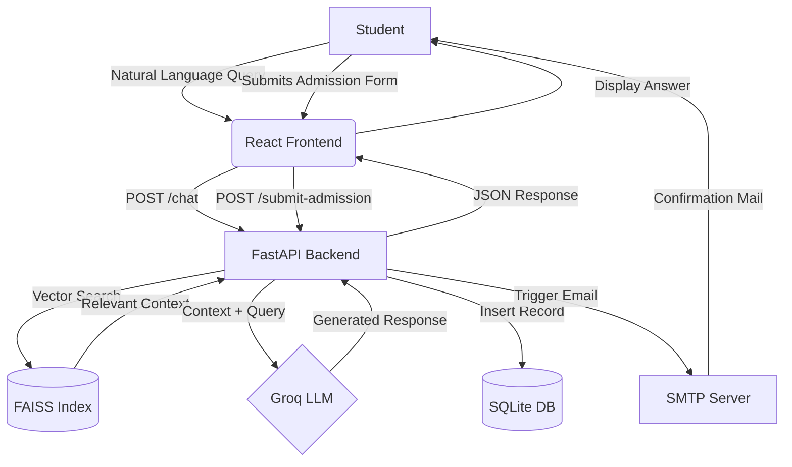

# MIET STUDENT HELPDESK CHATBOT - PROJECT DOCUMENTATION

---

## TABLE OF CONTENTS
1. [Abstract](#abstract)
2. [Introduction](#1-introduction)
    - [1.1 Project Definition](#11-project-definition)
3. [System Study](#2-system-study)
    - [2.1 Existing System](#21-existing-system)
    - [2.2 Proposed System](#22-proposed-system)
    - [2.3 Need for Computerization](#23-need-for-computerization)
    - [2.4 Modules](#24-modules)
4. [System Specification](#3-system-specification)
    - [3.1 Hardware Requirement](#31-hardware-requirement)
    - [3.2 Software Requirement](#32-software-requirement)
    - [3.3 Special Feature of Language / Utilities](#33-special-feature-of-language--utilities)
5. [System Design](#4-system-design)
    - [4.1 Data Flow Diagram](#41-data-flow-diagram)
    - [4.2 Database Design](#42-database-design)
6. [System Implementation](#5-system-implementation)
    - [5.1 Screen Layout](#51-screen-layout)
    - [5.2 Source Code](#52-source-code)
7. [Testing](#6-testing)
    - [6.1 Testing Description](#61-testing-description)
8. [Conclusion](#conclusion)
9. [References](#references)

---

## ABSTRACT
The **MIET Student Helpdesk Chatbot** is an advanced AI-driven platform designed to modernize student support services for **M.I.E.T. Arts and Science College**. Integrated with **Retrieval-Augmented Generation (RAG)** technology, the system provides accurate, real-time responses by extracting information directly from official institutional documents (PDFs). The project combines a high-performance **FastAPI** backend with a responsive **React.js** frontend to deliver a seamless user experience. Key features include automated admission inquiries, instant email confirmations via SMTP, and a secure administrative dashboard for knowledge base management.

---

## 1. INTRODUCTION

### 1.1 Project Definition
The project aims to build a 24/7 intelligent helpdesk that acts as the primary digital interface for prospective and current students. It interprets natural language queries using Large Language Models (LLMs) and ensures data integrity by restricting its knowledge base strictly to verified college documents.

---

## 2. SYSTEM STUDY

### 2.1 Existing System
The current helpdesk system relies heavily on manual intervention. Students either visit the campus physically, call administrative offices during working hours, or browse through extensive PDF documents manually to find information about courses, fees, and admissions.
- **Limitations**: Restricted working hours, human-dependent accuracy, slow response times, and difficulty in managing large volumes of concurrent inquiries.

### 2.2 Proposed System
The proposed system introduces an AI agent that eliminates manual latency. By using **FAISS** for vector search and **Groq LLM** for response synthesis, the system provides "human-like" interaction while remaining strictly grounded in college facts.
- **Advantages**: 24/7 availability, instant response, automated lead generation, and professional email communication.

### 2.3 Need for Computerization
Automation is essential for MIET to handle the increasing volume of student applications and inquiries. Computerization ensures that no student query goes unanswered and that all admission data is captured accurately in a centralized database for administrative review.

### 2.4 Modules
1. **Chatbot Module (RAG Engine)**: Handles user queries and retrieves relevant information from the vector database.
2. **Knowledge Processor Module**: Manages the ingestion of PDFs and URLs into the AI's knowledge base.
3. **Admission & Lead Module**: Captures student data via interactive forms and stores them in SQLite.
4. **Notification Module (SMTP)**: Sends automated, branded confirmation emails to applicants.
5. **Admin Dashboard**: Provides a secure interface for staff to manage data and update AI knowledge.

---

## 3. SYSTEM SPECIFICATION

### 3.1 Hardware Requirement
- **Processor**: Intel Core i3 or higher (Quad-core recommended for embedding generation)
- **RAM**: Minimum 8GB (To handle vector search and local embeddings)
- **Storage**: 500MB+ (For SQLite database and FAISS index)
- **Internet**: Required for LLM API (Groq) and SMTP services.

### 3.2 Software Requirement
- **Operating System**: Windows 10/11 or Linux (Ubuntu 20.04+)
- **Backend Language**: Python 3.9 or higher
- **Frontend Language**: JavaScript (Node.js 18+)
- **Backend Framework**: FastAPI
- **Frontend Framework**: React.js (Vite)
- **Database**: SQLite3 (Transactional) and FAISS (Vector Store)

### 3.3 Special Feature of Language / Utilities
- **LangChain**: For orchestrating the RAG pipeline.
- **HuggingFace Transformers**: Used for generating high-quality text embeddings (`all-MiniLM-L6-v2`).
- **SMTP lib**: Used for automated college-branded email alerts.
- **Tailwind CSS**: For a modern, premium aesthetic.

---

## 4. SYSTEM DESIGN

### 4.1 Data Flow Diagram (DFD)


### 4.2 Database Design
- **SQLite (Admissions Table)**:
  - `id`: Primary Key (Auto-increment)
  - `full_name`: TEXT
  - `email`: TEXT
  - `phone`: TEXT
  - `category`: TEXT (UG/PG)
  - `course`: TEXT
  - `marks`: TEXT
  - `submitted_at`: TIMESTAMP
- **FAISS (Vector Database)**:
  - Stores high-dimensional vectors representing document chunks for semantic similarity search.

---

## 5. SYSTEM IMPLEMENTATION

### 5.1 Screen Layout
1. **Home Screen**: A professional landing page with the college's branding and a "Chat Now" widget.
2. **Chat Interface**: A WhatsApp-like chat window supporting markdown, buttons, and tables.
3. **Admission Form**: A multi-step interactive form with validation and program-specific dropdowns.
4. **Admin Panel**: A secure login area featuring "Train AI" (drag-and-drop PDF upload) and "View Admissions" (data grid view).

### 5.2 Source Code (Key Snipets)
**Backend: RAG Query Implementation**
```python
# Extracting context and generating AI response
docs = v_store.similarity_search_with_score(query, k=10)
relevant_docs = [doc for doc, score in docs if score < 1.65]
context = "\n\n".join([doc.page_content for doc in relevant_docs])

messages = [
    SystemMessage(content=system_template.format(context=context)),
    HumanMessage(content=query)
]
response = chat_llm.invoke(messages)
```

**Frontend: Chat Integration**
```javascript
const sendMessage = async (query) => {
  const res = await axios.post(`${API_URL}/chat`, { query, session_id });
  setMessages([...messages, { type: 'bot', text: res.data.answer }]);
};
```

---

## 6. TESTING

### 6.1 Testing Description
- **Unit Testing**: Verified the documentation processor (`knowledge_processor.py`) against various file formats (.pdf, .docx, .txt).
- **Integration Testing**: Tested the end-to-end flow from frontend form submission to backend SQLite insertion and SMTP delivery.
- **RAG Validation**: Checked the accuracy of AI responses against "hallucination cases" where information was not present in the PDFs.
- **User Acceptance Testing (UAT)**: Verified the UI responsiveness on mobile and desktop devices.

---

## CONCLUSION
The **MIET Student Helpdesk Chatbot** project successfully bridge the gap between institutional information and student inquiries. By integrating RAG technology, the system ensures that AI responses are reliable and college-specific. The automated admission flow significantly reduces administrative overhead and improves the student conversion rate. Future enhancements could include voice-to-text capabilities and multi-lingual support (Tamil/English).

---

## REFERENCES
1. **FastAPI Documentation**: https://fastapi.tiangolo.com/
2. **React Official Docs**: https://react.dev/
3. **LangChain Framework**: https://python.langchain.com/
4. **FAISS Vector Library**: https://github.com/facebookresearch/faiss
5. **Groq AI Models**: https://groq.com/
