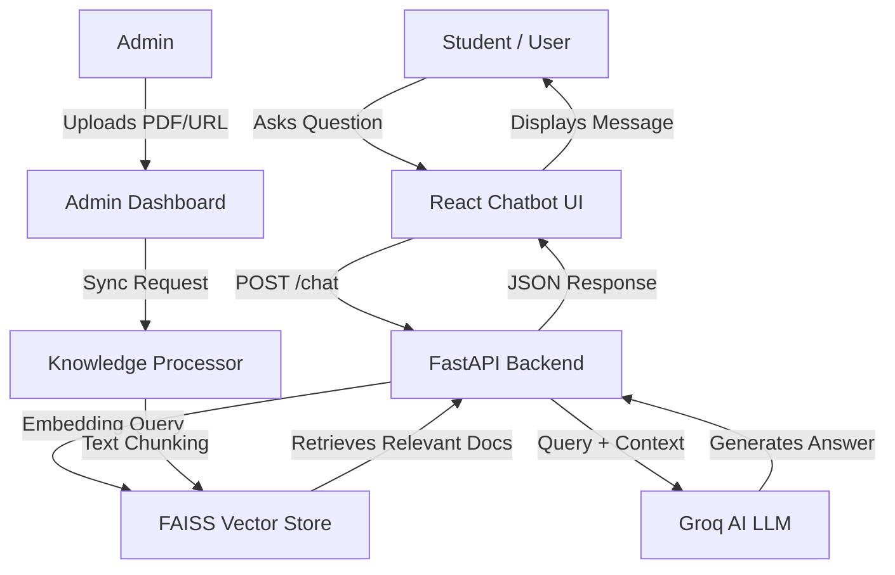
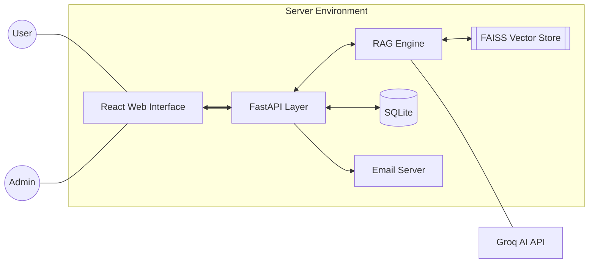

# PROJECT REPORT: M.I.E.T. ARTS & SCIENCE COLLEGE AI STUDENT HELPDESK

## 1. ABSTRACT
The **M.I.E.T. AI Student Helpdesk** is an advanced Retrieval-Augmented Generation (RAG) system designed to transform how students interact with the institution. By combining modern web technologies with Large Language Models (LLMs), the system provides instant, accurate responses to queries regarding courses, admissions, and campus facilities. The project integrates a specialized "Knowledge Processor" that allows administrators to sync PDFs and website data directly into the AI’s brain, ensuring that the information provided is always up-to-date and specific to the college's context.

## 2. OBJECTIVES
*   **Instant Query Resolution**: To provide 24/7 automated support to prospective and current students without human intervention.
*   **Automated Admissions**: To streamline the enrollment process through a digital multi-step admission form with real-time validation.
*   **Context-Aware Intelligence**: To implement a system that strictly follows provided college documents (PDFs/URLs) to prevent AI hallucinations.
*   **Efficiency in Communication**: To automate student notifications via professional email confirmations upon successful application submission.
*   **Dynamic Knowledge Management**: To allow non-technical staff to update the chatbot's knowledge base via a simple admin interface.

## 3. SYSTEM ANALYSIS

### 3.1 Existing System
The traditional student inquiry system relies heavily on manual labor:
*   **Physical Presence**: Students often need to visit the campus or call specific departments for minor queries.
*   **Response Lag**: Inquiry emails and phone calls often face delays due to office hours or staff availability.
*   **Limited Availability**: Support is restricted to 10:00 AM – 5:00 PM on business days.
*   **Manual Data Entry**: Admission forms are often paper-based or simple static forms that require manual verification and separate data entry.

### 3.2 Proposed System
The AI Helpdesk addresses these challenges by introducing:
*   **24/7 AI Availability**: A high-speed chatbot that responds in under 2 seconds.
*   **Retrieval-Augmented Generation (RAG)**: The system "reads" the college's official PDFs and websites before answering, ensuring high accuracy.
*   **Streamlined Digital Workflow**: Integrated admission forms that save data to a secure database and trigger instant email receipts.
*   **Administrative Control**: A central dashboard (AI Training Lab) to manage knowledge and view registrations.

## 4. SYSTEM MODULES

### 4.1 AI Knowledge Engine (Backend Core)
The heart of the system is built with **FastAPI** and **LangChain**. It uses **HuggingFace Embeddings** to convert text into mathematical vectors, which are then stored in a **FAISS** index for ultra-fast similarity searches. When a user asks a question, the system retrieves the most relevant paragraphs from the knowledge base and sends them to the **Groq (GPT-based) LLM** to generate a human-like response.

### 4.2 Administrative Intelligence Lab
A secure interface for college staff to:
*   **Knowledge Sync**: Upload PDFs or enter URLs (e.g., `miet.edu/about`) to train the AI instantly.
*   **Submission Tracking**: View and manage all student admission applications in real-time.
*   **Session Monitoring**: Track active user sessions and system health.

### 4.3 Professional Admission Gateway
A premium, multi-step React-based form that captures candidate details across three phases:
*   **Personal Identity**: Contact and location details.
*   **Academic Choice**: Dynamic selection of UG, PG, and Research courses.
*   **History & Verification**: Previous academic records with automated aggregate calculation.

### 4.4 Automated Communication Hub
A background service that connects to the **SMTP Relay** to deliver professional admission confirmation letters. It includes a custom-built HTML template engine that ensures emails are branded with the **M.I.E.T.** logo and colors.

## 5. TECHNICAL STACK

| Layer | Technology |
| :--- | :--- |
| **Frontend UI** | React.js, Vite, Lucide React (Icons) |
| **Styling** | Vanilla CSS3 (Custom Design System) |
| **Backend API** | FastAPI (Python 3.10+) |
| **AI Framework** | LangChain, HuggingFace Transformers |
| **Large Language Model** | Groq LLaMA/GPT-OSS |
| **Vector Database** | FAISS (Facebook AI Similarity Search) |
| **Primary Database** | SQLite (Relational Storage) |
| **File Processing** | PyPDF, Docx2txt |

## 6. DATA FLOW DIAGRAM (DFD)

## 7. DATA STORAGE ARCHITECTURE

### 7.1 Relational Database (SQLite)
Stores structured student data:
*   `id` (Primary Key)
*   `full_name`, `email`, `phone`
*   `category`, `course`
*   `marks`, `prev_college`
*   `submitted_at`

### 7.2 Vector Store (FAISS)
Stores unstructured knowledge in specialized `.index` and `.pkl` files within the `database/` directory, allowing for semantic search rather than just keyword matching.

## 8. OVERALL SYSTEM ARCHITECTURE

## 9. CONCLUSION
The **M.I.E.T. Arts & Science College AI Helpdesk** represents a significant step towards the "Digital Campus" vision. By automating the inquiry and admission process, the institution can redirect human resources to more complex tasks while providing students with a modern, efficient, and sophisticated support system. The modular nature of the project ensures it can be scaled to include additional features like results checking, fee payment integration, and hostel management in the future.
