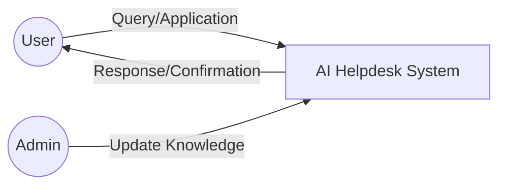
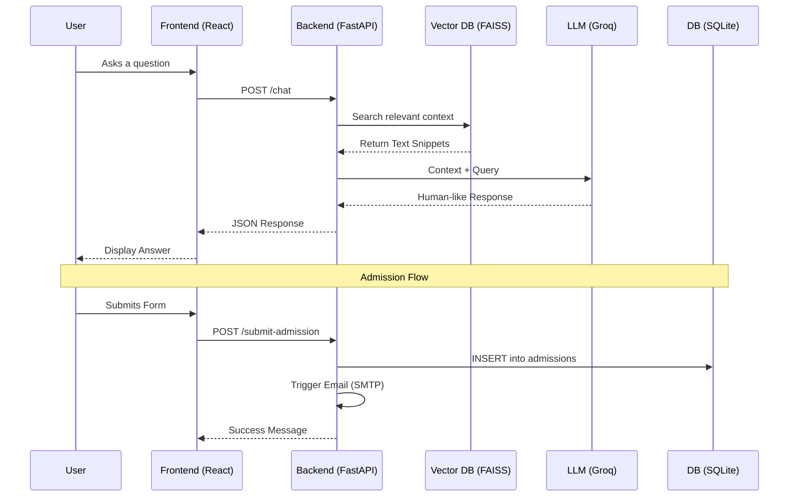

# MIET Student Helpdesk Chatbot - Project Documentation

## 1. Abstract
The **MIET Student Helpdesk Chatbot** is a modern, AI-driven solution designed to automate student support for MIET Arts and Science College. Leveraging **Retrieval-Augmented Generation (RAG)**, the chatbot provides precise, context-aware answers by retrieving information directly from official college documents (PDFs). Unlike traditional rule-based bots, this system interprets natural language and offers a "human-like" interaction experience. It also streamlines the admission process by providing interactive forms, automated email confirmations, and an administrative panel for managing the college's digital knowledge base.

---

## 2. Objective
The primary objectives of this project are:
- **24/7 Availability**: To provide students and parents with instant support outside of office hours.
- **Accuracy through RAG**: To eliminate hallucinations by forcing the AI to answer only based on verified college documents.
- **Seamless Admissions**: To digitize the initial admission inquiry and application flow.
- **Administrative Efficiency**: To allow college staff to update the chatbot's knowledge base easily without writing code.
- **Automated Communication**: To ensure students receive immediate feedback via email upon applying.

---

## 3. Existing System
Historically, student helpdesks rely on:
- **Manual Staffing**: Requiring human agents to answer repetitive questions via phone or email.
- **Static FAQs**: Difficult-to-navigate lists of questions that often lack the specific detail a student needs.
- **Physical Visits**: Requiring students to travel to campus for basic inquiries about courses and fees.
- **Manual Data Entry**: Admission inquiries are often recorded on paper or in disjointed spreadsheets, leading to delays and errors.

**Limitations**: High latency, limited availability, human error, and difficulty in updating large volumes of institutional information.

---

## 4. Proposed System
The proposed system introduces an intelligent **AI Helpdesk Agent** integrated directly into the college's web ecosystem.
- **Interactive Chat Interface**: A floating chatbot window that understands natural language queries.
- **Document-Driven Intelligence**: The system converts college PDFs into multi-dimensional vectors stored in a database for rapid retrieval.
- **Integrated Application Portal**: A dedicated module for course discovery and online application.
- **Instant Confirmation**: Integrated SMTP services to send professional email acknowledgments.
- **Admin Control**: A secure dashboard to monitor applications and update the AI's "brain" (knowledge base).

---

## 5. Tech Stack
### **Frontend**
- **React.js (Vite)**: Modern UI library for a fast, responsive user experience.
- **Tailwind CSS / Vanilla CSS**: Custom styling for a premium college-themed aesthetic.
- **Axios**: For asynchronous communication with the backend API.
- **Lucide React**: For high-quality, lightweight UI icons.

### **Backend**
- **FastAPI (Python)**: High-performance web framework for building the RAG API.
- **LangChain**: The core framework for orchestrating the RAG pipeline.
- **Groq LLM**: Used for generating high-speed, intelligent responses.
- **FAISS (Facebook AI Similarity Search)**: High-performance vector database for local storage of document embeddings.
- **HuggingFace Embeddings**: Specifically `all-MiniLM-L6-v2` for converting text into numerical vectors.
- **SQLite3**: Lightweight database for storing student admission applications.

---

## 6. System Architecture & Modules

### **6.1 Chatbot Module (RAG Engine)**
This is the core of the system. It handles user messages, performs a similarity search in the FAISS database to find relevant document sections, and sends that context to the LLM to generate an answer.

### **6.2 Knowledge Processor Module**
Responsible for:
- Reading PDF/Docx files using `PyPDF` and `Docx2txt`.
- Splitting text into manageable "chunks".
- Generating embeddings and saving them to the FAISS index.

### **6.3 Admission & Lead Management Module**
Facilitates the student application flow. It includes a dynamic form that captures:
- Personal details (Name, Email, Phone).
- Academic history (Previous college, Marks).
- Program of interest (UG/PG Categories and specific courses).

### **6.4 Notification Module (SMTP)**
Uses Python's email libraries to send automated, branded HTML emails to students once they submit their admission form, confirming their application has been received.

### **6.5 Admin Dashboard Module**
A protected interface where administrators can:
- **Upload Knowledge**: Replace old PDFs with new ones to update the chatbot’s logic.
- **View Admissions**: List and export the details of students who have applied through the bot.

---

## 7. Data Flow Diagram (DFD)

### **Logic Level 0 (Overview)**

### **Logic Level 1 (Internal Flow)**

---

## 8. Conclusion
The **MIET Student Helpdesk Chatbot** represents a significant leap forward in campus automation. By combining modern AI techniques like **RAG** with traditional web technologies, the project provides a scalable, accurate, and user-friendly platform. It reduces the operational burden on college staff while providing students with a sophisticated tool to navigate their academic journey. The system is designed for future expansion, with the capability to integrate with larger ERP systems or add multi-modal features like voice interaction.
